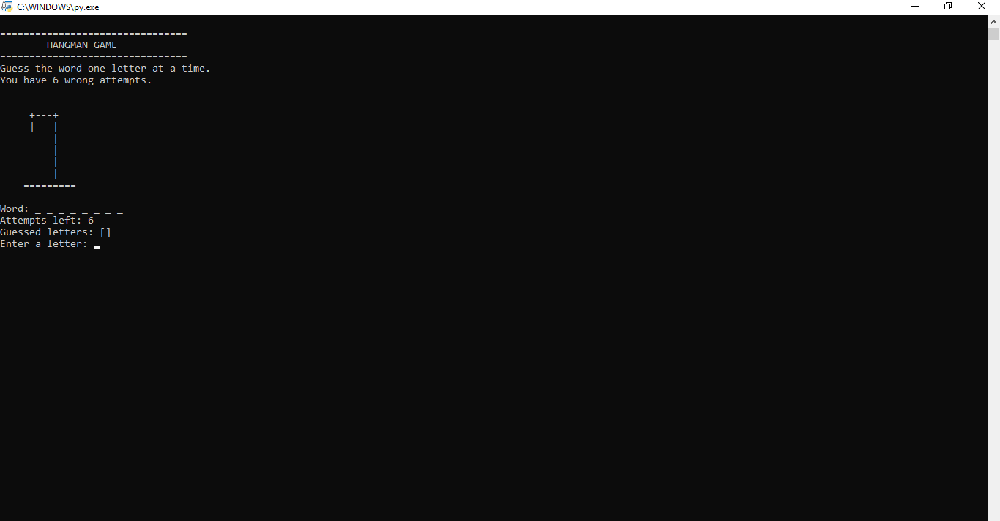
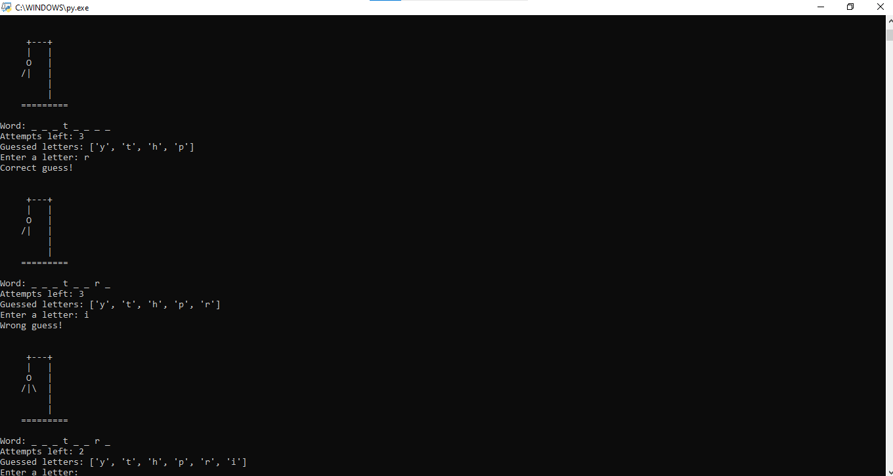
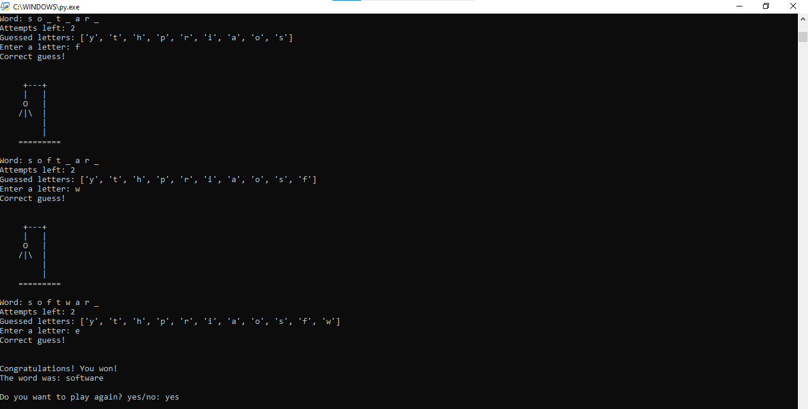
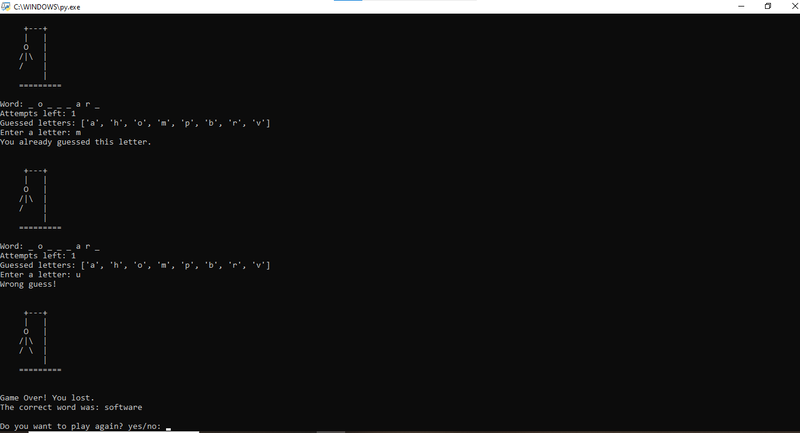

# 🎮 CodeAlpha Hangman Game

A simple and interactive **text-based Hangman Game** built using **Python**. The player must guess the hidden word one letter at a time before running out of six incorrect attempts. This project demonstrates the use of Python fundamentals such as loops, conditional statements, functions, lists, strings, and the `random` module.

---

## 📌 Project Description

The Hangman Game is a console-based Python application that randomly selects a word from a predefined list. The player guesses one letter at a time to reveal the hidden word. Each incorrect guess reduces the remaining attempts and updates the Hangman drawing. The game ends when the player either guesses the complete word or uses all six attempts.

---

## ✨ Features

- 🎲 Random word selection
- 🔤 Letter-by-letter guessing
- ❤️ Six incorrect attempts
- 📋 Displays guessed letters
- 🚫 Prevents duplicate guesses
- 🎨 ASCII Hangman drawings
- 🎯 Win and Lose messages
- 🔁 Play Again option
- 💻 Console-based interface

---

## 🛠️ Technologies Used

- Python 3
- Random Module
- Command Line Interface (CLI)

---

## 📂 Project Structure

```text
CodeAlpha_HangmanGame/
│
├── hangman.py
├── README.md
├── LICENSE
└── screenshots/
    ├── start.png
    ├── gameplay.png
    ├── win.png
    └── lose.png
```

---

## ▶️ How to Run

### 1. Clone the Repository

```bash
git clone https://github.com/minakshi3097sharma-cloud/CodeAlpha_HangmanGame.git
```

### 2. Navigate to the Project Folder

```bash
cd CodeAlpha_HangmanGame
```

### 3. Run the Program

```bash
python hangman.py
```

---

## 🎮 How to Play

1. Run the Python program.
2. A random word will be selected.
3. Guess one letter at a time.
4. Correct guesses reveal the letters in the word.
5. Incorrect guesses reduce your remaining attempts.
6. You have **6 incorrect attempts**.
7. Guess the complete word before the Hangman is fully drawn.

---

## 📚 Python Concepts Used

- Variables
- Lists
- Strings
- Loops (`while`)
- Conditional Statements (`if-else`)
- Functions
- User Input (`input()`)
- Random Module

---

## 📸 Screenshots

### 🏠 Start Screen



### 🎮 Gameplay



### 🏆 Winning Screen



### ❌ Losing Screen



---

## 🚀 Future Improvements

- Add difficulty levels (Easy, Medium, Hard)
- Add different word categories
- Implement a hint system
- Save high scores
- Add colored terminal output
- Create a GUI version using Tkinter
- Add sound effects

---

## 🎯 Learning Outcomes

This project helped me strengthen my understanding of:

- Python programming fundamentals
- Problem-solving and logical thinking
- Working with loops and conditional statements
- Functions and modular programming
- String and list manipulation
- Building an interactive console application

---

## 👩‍💻 Author

**Minakshi Sharma**

- 🎓 BCA Student
- 💻 Python Enthusiast
- 🌐 GitHub: https://github.com/minakshi3097sharma-cloud

---

## 📜 License

This project is licensed under the **MIT License**.

---

## ⭐ Support

If you found this project helpful, please consider giving it a **⭐ Star** on GitHub. Your support is appreciated!

Happy Coding! 🚀
